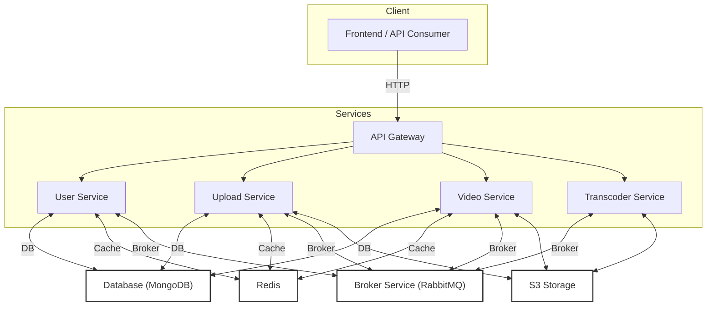

# Pod-Flix Monorepo

A scalable, microservices-based video platform built with Node.js, TypeScript, and Docker.

## Architecture



**How it works:**
- The API Gateway is the single entry point for all client requests.
- Each microservice (User, Upload, Video, Transcoder) handles a specific domain.
- MongoDB is used for persistent storage, Redis for caching, and RabbitMQ for asynchronous communication.
- S3 (or compatible storage) is used for video file storage and retrieval.

## Monorepo Structure

- **apps/**
  - **api-gateway**: Entry point for client requests, routes/aggregates to other services.
  - **user-service**: User registration, authentication, channels.
  - **upload-service**: Handles video uploads.
  - **video-service**: Video streaming, interactions (likes, comments).
  - **transcoder-service**: Video transcoding and S3 integration.
  - **broker-service**: Message brokering (RabbitMQ).
- **packages/**
  - **database**: Shared DB connection and models.
  - **redis**: Redis client and caching utilities.
  - **rabbitmq**: RabbitMQ exchanges and setup.
  - **types**: Shared TypeScript types.
  - **utils**: Common utilities (JWT, password, status codes).

## API Overview

### Video-service (`/video/api/v1`)
- **POST**
  - `/stream/:videoId` — Returns an S3 signed URL for streaming.
  - `/update-interaction` — Updates like/dislike.
  - `/add-comment` — Adds a comment to a video.
  - `/reply-comment` — Replies to a comment.
- **DELETE**
  - `/delete-comment` — Deletes a comment.
- **GET**
  - `/getall-likes` — Gets total like count for a video.
  - `/get-comments` — Gets all comments and reply counts for a video.

### User-service (`/api/v1`)
- **POST**
  - `/register` — Register a new user.
  - `/login` — User login.
  - `/refresh-token` — Refresh JWT access token.
  - `/logout` — Logout user (clears cookies).

## Development

### Prerequisites
- Node.js
- pnpm
- Docker

### Install dependencies
```sh
pnpm install
```

### Start all services (dev mode)
```sh
pnpm run start:all
```

### Build shared packages
```sh
pnpm run build:shared
```

### Docker Compose (for Redis & RabbitMQ)
```sh
docker-compose up -d
```
- Redis: `localhost:6379`
- RabbitMQ: `localhost:5672` (management UI: `localhost:15672`)

## Notes

- Each service has its own `server.ts` entry point and can be run/tested independently.
- Shared logic is abstracted into the `packages/` directory.
- Uses cookies for authentication (accessToken, refreshToken).
- Logging is enabled via `morgan` in user-service.