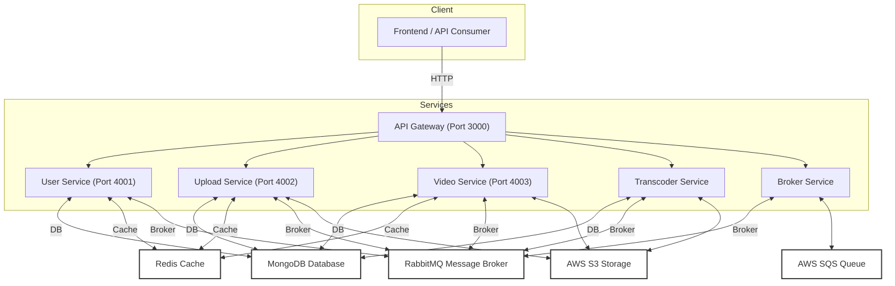

# Pod-Flix Video Microservice Platform

A scalable, microservices-based video streaming platform built with Node.js, TypeScript, and Docker. This platform provides video upload, transcoding, streaming, and user interaction capabilities with a modern microservices architecture.

## 🏗️ Architecture


```mermaid
flowchart TD
  subgraph Client
    A["Frontend / API Consumer"]
  end

  A -->|HTTP| B["API Gateway (Port 3000)"]

  subgraph Services
    B --> C["User Service (Port 4001)"]
    B --> D["Upload Service (Port 4002)"]
    B --> E["Video Service (Port 4003)"]
    B --> F["Transcoder Service"]
    B --> G["Broker Service"]
  end

  C <--> |DB| H["MongoDB Database"]
  D <--> |DB| H
  E <--> |DB| H
  F <--> |DB| H

  C <--> |Cache| I["Redis Cache"]
  D <--> |Cache| I
  E <--> |Cache| I

  C <--> |Broker| J["RabbitMQ Message Broker"]
  D <--> |Broker| J
  E <--> |Broker| J
  F <--> |Broker| J
  G <--> |Broker| J

  D <--> K["AWS S3 Storage"]
  F <--> K
  E <--> K

  G <--> L["AWS SQS Queue"]

  style H fill:#fff,stroke:#333,stroke-width:2px
  style I fill:#fff,stroke:#333,stroke-width:2px
  style J fill:#fff,stroke:#333,stroke-width:2px
  style K fill:#fff,stroke:#333,stroke-width:2px
  style L fill:#fff,stroke:#333,stroke-width:2px
```

### How it works:
- **API Gateway** (Port 3000): Single entry point that routes requests to appropriate microservices
- **User Service** (Port 4001): Handles user authentication, registration, and channel management
- **Upload Service** (Port 4002): Manages video uploads and S3 integration
- **Video Service** (Port 4003): Handles video streaming, interactions (likes, comments), and view tracking
- **Transcoder Service**: Processes uploaded videos into multiple quality variants using HLS
- **Broker Service**: Bridges AWS SQS and RabbitMQ for video processing workflow
- **MongoDB**: Persistent storage for users, channels, videos, and interactions
- **Redis**: Caching layer for video data, user sessions, and like counts
- **RabbitMQ**: Asynchronous message queuing for video processing and like updates
- **AWS S3**: Video file storage and retrieval
- **AWS SQS**: Integration with AWS services for video upload notifications

## 📁 Monorepo Structure

```
├── apps/
│   ├── api-gateway/          # Entry point for all client requests
│   ├── user-service/         # User authentication & channel management
│   ├── upload-service/       # Video upload handling
│   ├── video-service/        # Video streaming & interactions
│   ├── transcoder-service/   # Video transcoding & HLS generation
│   └── broker-service/       # AWS SQS to RabbitMQ bridge
├── packages/
│   ├── database/             # Shared MongoDB connection & models
│   ├── redis/               # Redis client & caching utilities
│   ├── rabbitmq/            # RabbitMQ exchanges & setup
│   ├── types/               # Shared TypeScript type definitions
│   └── utils/               # Common utilities (JWT, password, status codes)
└── docker-compose.yml       # Infrastructure services (Redis, RabbitMQ)
```

## 🔌 API Endpoints

### API Gateway Routes
All requests go through the API Gateway at `http://localhost:3000`:

- `/user/*` → User Service (Port 4001)
- `/upload/*` → Upload Service (Port 4002)  
- `/video/*` → Video Service (Port 4003)

### User Service (`/user/api/v1`)
**Authentication & User Management:**
- `POST /register` - Register a new user with profile image
- `POST /login` - User login with JWT tokens
- `POST /refresh-token` - Refresh JWT access token
- `POST /logout` - Logout user (clears cookies)
- `GET /me` - Get current user profile

**Channel Management:**
- `POST /create-channel` - Create a new channel
- `GET /channels` - Get user's channels
- `PUT /update-channel` - Update channel information

### Upload Service (`/upload/api/v1`)
**Video Upload (Requires Authentication):**
- `POST /upload-video` - Upload video with database sync
- `POST /upload-video-test` - Test video upload endpoint

### Video Service (`/video/api/v1`)
**Streaming (Public):**
- `GET /stream/:videoId` - Get S3 signed URL for video streaming
- `GET /processed-videos` - Get all processed videos (paginated)

**Interactions (Requires Authentication):**
- `POST /update-interaction` - Update like/dislike on video
- `GET /getall-likes` - Get total like count for a video
- `POST /add-comment` - Add a comment to a video
- `POST /reply-comment` - Reply to a comment
- `GET /get-comments/:videoId` - Get all comments for a video
- `DELETE /delete-comment` - Delete a comment
- `GET /views/:videoId` - Get video view statistics

## 🚀 Development Setup

### Prerequisites
- **Node.js** (v18 or higher)
- **pnpm** (v10.11.0 or higher)
- **Docker** and **Docker Compose**
- **MongoDB** (local or cloud instance)
- **AWS Account** (for S3 and SQS)

### Environment Variables
Create `.env` files in each service directory with the following variables:

```env
# Common for all services
PORT=4001                    # Service-specific port
MONGODB_URL=mongodb://localhost:27017
MONGODB_DB_NAME=podflix
JWT_SECRET=your_jwt_secret
JWT_ACCESSTOKEN_TIME=15m
JWT_REFRESHTOKEN_TIME=7d

# AWS Configuration
AWS_ACCESS_KEY=your_aws_access_key
AWS_SECRET_KEY=your_aws_secret_key
AWS_REGION=us-east-1
AWS_S3_UPLOAD_BUCKET_NAME=your-upload-bucket
AWS_S3_DOWNLOAD_BUCKET_NAME=your-processed-bucket
AWS_SQS_QUEUE_URL=your_sqs_queue_url

# Optional: Google OAuth (for user service)
GOOGLE_CLIENT_ID=your_google_client_id
GOOGLE_CLIENT_SECRET=your_google_client_secret
GOOGLE_REDIRECT_URI=http://localhost:4001/auth/google/callback
```

### Installation & Running

1. **Install dependencies:**
```bash
pnpm install
```

2. **Start infrastructure services:**
```bash
docker-compose up -d
```
This starts:
- Redis on `localhost:6379`
- RabbitMQ on `localhost:5672` (Management UI: `localhost:15672`)

3. **Build shared packages:**
```bash
pnpm run build:shared
```

4. **Start all services (development mode):**
```bash
pnpm run start:all
```

This starts all services concurrently:
- API Gateway: `http://localhost:3000`
- User Service: `http://localhost:4001`
- Upload Service: `http://localhost:4002`
- Video Service: `http://localhost:4003`
- Transcoder Service: Background processing
- Broker Service: SQS polling

### Individual Service Development

Each service can be run independently:

```bash
# User Service
cd apps/user-service
pnpm dev

# Upload Service  
cd apps/upload-service
pnpm dev

# Video Service
cd apps/video-service
pnpm dev

# API Gateway
cd apps/api-gateway
pnpm dev
```

## 🔧 Key Features

### Video Processing Pipeline
1. **Upload**: Video uploaded to S3 via Upload Service
2. **Notification**: S3 triggers SQS notification
3. **Broker**: Broker Service polls SQS and publishes to RabbitMQ
4. **Transcoding**: Transcoder Service processes video into HLS variants
5. **Storage**: Processed videos uploaded to S3 download bucket
6. **Streaming**: Video Service provides signed URLs for streaming

### Authentication & Security
- JWT-based authentication with access and refresh tokens
- Cookie-based token storage
- Middleware protection for sensitive endpoints
- Input validation using Zod schemas

### Caching Strategy
- Redis caching for video metadata and user sessions
- Like count caching with batch updates
- Username availability caching

### Error Handling
- Centralized error handling middleware
- Unified response format across services
- Graceful degradation for service failures

## 📊 Monitoring & Logging

- **Morgan** logging enabled in User Service
- Console logging for service status and errors
- RabbitMQ management UI for message monitoring
- Redis monitoring for cache performance

## 🐳 Docker Support

The platform includes Docker Compose for infrastructure services. For full containerization, each service can be containerized individually.

## 🔄 Message Flow

1. **Video Upload Flow:**
   ```
   Client → API Gateway → Upload Service → S3 → SQS → Broker → RabbitMQ → Transcoder → S3
   ```

2. **Like Update Flow:**
   ```
   Client → API Gateway → Video Service → RabbitMQ → Video Service (Consumer)
   ```

3. **Video Streaming Flow:**
   ```
   Client → API Gateway → Video Service → S3 (Signed URL)
   ```

## 📝 Notes

- Each service is independently deployable and testable
- Shared logic is abstracted into the `packages/` directory
- Uses workspace dependencies for shared packages
- Supports both development and production configurations
- Includes comprehensive error handling and validation
- Designed for horizontal scaling of individual services